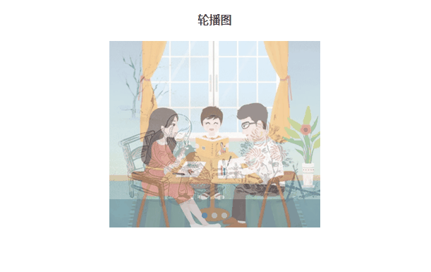

<br>
# 轮播图

<p align="center">
  
  
</p>

------

<br>

### 组件功能
在有限空间内，循环播放同一类型的图片，文字等内容。支持无缝轮播、淡入淡出轮播和多图轮播
  默认轮播
  
  淡入淡出轮播
  
  无缝轮播
  
  多图轮播
  
<br>

### 组件参数及事件

**参数**

| 参数                | 说明                                                         | 类型    | 默认值   |
| ------------------- | :----------------------------------------------------------- | ------- | -------- |
| mode                | 切换模式。0为插卡式轮播，1为淡入淡出轮播，2为无缝轮播             | Number  | 0        |
| autoPlay                 | 自动轮播间隔时长(ms)，0为关闭自动轮播                          | Number  | 3000     |
| multi             | 是否开启多图模式（即容器宽度大于单张轮播图宽度，可视区展示多张轮播图时可能需要开启。容器宽度最好是倍数方式大于单张轮播图的宽度）                                             | Boolean  | false        |
| arrow          | 上/下一张按钮显示时机。0（不显示）， 1（悬停），2（一直显示）                           | Number  | 1       |
| page             | 是否显示分页器                                             | Boolean  | true     |
| trigger             | 触发分页按钮轮播的事件 | String  | mouseenter     |


**事件**


| 事件名             | 说明                        | 返回值
| ----------------- | :-------------------------- | ----------------------------------------
| change            | 幻灯片切换时触发               | 目前激活的幻灯片的索引，原幻灯片的索引

<br>

### 使用方法
1、使用npm 下载组件到项目中，引入后，需要给容器指定宽高，给slider指定宽度（通常就指定为容器的宽度）

```html
<template>
  <h2>轮播图</h2>
  <banner-change>
    <div class="fly-banner-slider" v-for="(item,index) in imgList" :key="index">
      <a :href="item.link" target="_blank">
        
      </a>
    </div>
  </banner-change>
</template>
```

```javascript
import bannerChange from "@edu/app-banner-change"

export default {
  name: "app",
  components: { bannerChange },
  data() {
    return {
      imgList: [
        {
          link: 'https://www.baidu.com/',
          url: 'assets/1.png'
        },
        {
          link: 'https://www.qq.com/',
          url: 'assets/2.png'
        },
        {
          link: 'https://www.acfun.cn/',
          url: 'assets/3.png'
        },
      ]
    };
  }
};
```

```css
<style>
  .fly-banner-container {
    margin: auto;
    width: 299px;
    height: 265px;
    .fly-banner-slider {
      width: 299px;
    }
  }
</style>
```

2、普通html中直接引入使用

```html
<!DOCTYPE html>
<html lang="en">
<head>
  <meta charset="utf-8">
  <title>banner-change</title>
  <script src="https://cdn.staticfile.org/vue/2.5.2/vue.min.js"></script>
  <script src="../dist/bannerChange.umd.js"></script>
</head>
<body>
  <div id="app">
    <banner-change>
      <div class="fly-banner-slider" v-for="(item,index) in imgList" :key="index">
        <a :href="item.link" target="_blank">
          
        </a>
      </div>
    </banner-change>
  </div>
  <script>
    new Vue({
      el: '#app'
    })
  </script>
</body>
</html>
```
